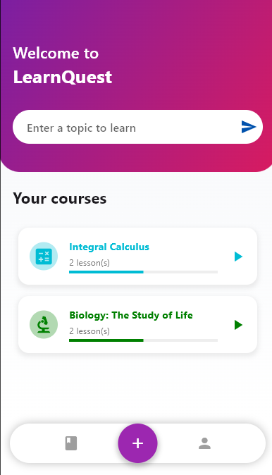
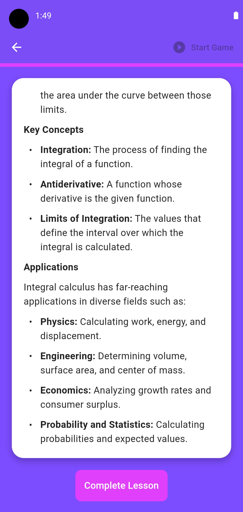
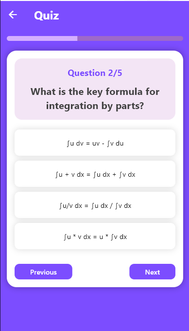

# LearnQuest

LearnQuest is an innovative learning application designed to offer interactive courses and lessons across various disciplines. Developed with Flutter and Firebase, and powered by Gemini technology, LearnQuest provides a flexible, adaptable, and accessible learning experience in both English and Spanish.

## Description

LearnQuest is designed to be your personalized learning companion, allowing you to access a wide range of courses and lessons at your own pace. The application combines advanced technologies to offer dynamic and engaging educational content.

## Key Features

- **Powered by Gemini:** We use Gemini to generate dynamic and personalized content, enhancing the quality of learning.
- **Secure Authentication:** Implemented with Firebase Authentication to ensure users' data is protected.
- **Multi-language Support:** Easily switch between English and Spanish according to your preferences.

## Tools and Technologies Used

- **Flutter:** The main framework used for app development.
- **Firebase Auth:** For user authentication and session management.
- **GeminiService:** Technology used to generate and adapt educational content based on the user's needs.
- **Provider:** State management within the app to handle themes and language settings.
- **QuickAlert:** To display quick and interactive alerts in the app.

## Screenshots

|  |  |  |
|:----------------------------------------:|:----------------------------------:|:----------------------------------:|
| *The Lesson Detail screen*            | *The LearnQuest home screen.*         | *The Lesson Detail screen*         |


## Installation

Follow these steps to install and run LearnQuest on your local device:

1. **Clone the repository:**
   ```bash
   git clone https://github.com/FlutterAppGemini/App_LearnQuest.git
   cd App_LearnQuest
2. **Install dependencies:**
   Open the pubspec.yaml file and press Ctlr+S, or alternatively, open a terminal and run the following command:
   ```bash
   flutter pub get
## Configuration

### Firebase Configuration

To ensure the application works correctly, you need to set up Firebase in your local environment.

1. **Create a Project in Firebase:**
   - Go to the [Firebase console](https://console.firebase.google.com/).
   - Create a new project and add your application (Android/iOS).

2. **Download Configuration Files:**
   - Download the `google-services.json` file (for Android) and/or the `GoogleService-Info.plist` file (for iOS) from the Firebase console.
   - Place the files in the corresponding directories in your project:
     - `android/app/google-services.json`
     - `ios/Runner/GoogleService-Info.plist`

3. **Environment Variables Configuration:**
   - Optionally, if you are using Firebase Environment Configuration, make sure to set up the necessary environment variables in your development environment and Firebase.

4. **Run the Application:**
   - Once Firebase is configured, you should be able to run the application without any issues.
### Generating `firebase_options.dart`

To configure Firebase for this project, you'll need to generate the `firebase_options.dart` file. This file contains the configuration details necessary for Firebase services like Authentication and Firestore. Follow the steps below to generate this file:

1. **Firebase CLI:** Ensure you have the Firebase CLI installed. You can install it via npm:

   ```bash
   npm install -g firebase-tools
2. **FlutterFire CLI:** Ensure you have the FlutterFire CLI installed. You can install it via dart pub:
   ```bash
   dart pub global activate flutterfire_cli
**Steps to Generate** firebase_options.dart
1. **Login to Firebase:** First, login to your Firebase account using the Firebase CLI:
   ```bash
   firebase login
2. **Initialize FlutterFire:** Navigate to the root directory of your Flutter project and run:
   ```bash
   flutterfire configure
This command will prompt you to select the Firebase project and the platforms (iOS, Android, etc.) that you want to configure. Make sure to select all the platforms you are using in your project.

3. **Generate the Configuration File:** After selecting the platforms, `flutterfire` will generate the `firebase_options.dart` file under the lib directory with the necessary configuration.

4. **Check Firebase Services:**
**Authentication:** If you're using Firebase Authentication, ensure that the necessary configurations are in place in the Firebase console and your app's code.

5. **Cloud Firestore:** Ensure that Firestore is properly initialized and configured in your app to handle data storage.

6. **Run the Application:** After generating the firebase_options.dart file and configuring Firebase, you should be able to run the application without any issues:
   ```bash
   flutter run